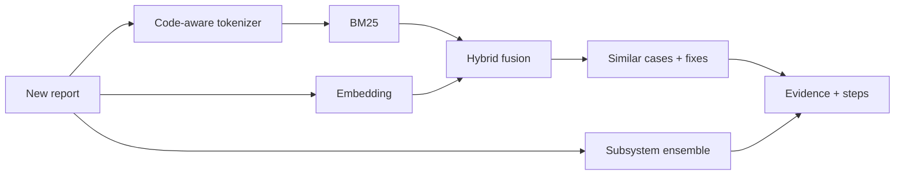

# trouble-report-investigator

Give it a new bug report and it finds similar older reports, predicts which subsystem is affected, and shows where to start looking.

## What I did
- Downloaded 14,037 public Mozilla Core bug reports through the Bugzilla API.
- Built a search for older reports that describe the same problem, combining BM25 keyword search with embedding search.
- Built a classifier that predicts the affected component (64 components) using TF-IDF logistic regression, embedding logistic regression and a vote from the most similar older reports.
- Wrote a code-aware tokenizer so a name like `mozilla::dom::ContentParent::RecvFoo` is split into its parts as well as kept whole.
- Tested with a time split: trained and indexed on the past, tested on 2024 reports, and only older reports can be searched.
- Made it produce suggested steps from the retrieved cases: which report to read first, which subsystem to start in, and which fixes resolved similar reports.
- Wrapped it in a command line tool and an HTTP API.

## Results (held-out 2024 reports)

**Finding earlier reports of the same problem** (399 duplicate reports):

| | recall@1 | recall@10 | MRR |
|---|---:|---:|---:|
| BM25 | 0.501 | 0.709 | 0.577 |
| dense embeddings | 0.561 | 0.784 | 0.636 |
| **hybrid** | **0.607** | **0.830** | **0.682** |

The hybrid beats BM25 by +0.12 recall@10 (95% CI 0.083 to 0.158).

**Predicting the affected subsystem** (2,689 reports):

| | top-1 | top-3 | right broad area |
|---|---:|---:|---:|
| most common component | 0.090 | 0.218 | 0.208 |
| TF-IDF + logistic regression | 0.593 | 0.800 | 0.697 |
| **ensemble** | **0.606** | **0.822** | **0.714** |

Full tables: [docs/EVALUATION.md](docs/EVALUATION.md).

## How it was built

## Tech stack
Python, FastAPI, Pydantic, scikit-learn, fastembed embeddings, BM25, httpx, Bugzilla REST API, Docker, mypy, ruff, pytest (58 tests).

## Data
Public bug reports from bugzilla.mozilla.org, fetched when you run it and not stored in this repo.
