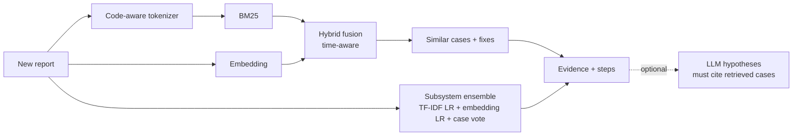

# trouble-report-investigator

Give it a new bug or trouble report. It finds similar historical reports, suggests the likely affected subsystem, shows the evidence, and recommends where to start investigating. Every claim points at a concrete earlier report, and the retrieval and prediction are measured on real data with a strict time split.

  

This is a **proxy study**. I built and measured it on 14,037 public Mozilla Core bug reports as a stand-in for engineering trouble reports in a large native-code platform. It uses no proprietary data. [How it would carry over to telecom trouble reports, and what would not](docs/APPLYING_TO_CLOUD_RAN_L1.md).

## Results (held-out 2024 reports, trained and indexed on the past only)

**Finding earlier reports of the same problem** (399 duplicate reports, 14,037-report corpus, only older reports searchable):

| | recall@1 | recall@10 | MRR |
|---|---:|---:|---:|
| BM25 (keyword baseline) | 0.501 | 0.709 | 0.577 |
| dense embeddings | 0.561 | 0.784 | 0.636 |
| **hybrid (tuned on 2023)** | **0.607** | **0.830** | **0.682** |

The hybrid beats BM25 by +0.12 recall@10 (95% CI 0.083 to 0.158).

**Predicting the affected subsystem** (64 components, 2,689 reports):

| | top-1 | top-3 | right broad area |
|---|---:|---:|---:|
| always the most common component | 0.090 | 0.218 | 0.208 |
| TF-IDF + logistic regression | 0.593 | 0.800 | 0.697 |
| **ensemble** | **0.606** | **0.822** | **0.714** |

An honest reading: a plain TF-IDF classifier does most of the work, and the ensemble adds only about 1 point. Even the broad area is wrong about 29% of the time. Full tables with confidence intervals, the protocol and the threats to validity are in [docs/EVALUATION.md](docs/EVALUATION.md).

## What it looks like

Real output, abridged:

```text
$ investigator investigate "HTTP/3 connection stalls after network change on mobile" \
    --description "After switching from wifi to mobile data the QUIC connection never recovers..."

Likely subsystems:
   0.53  Networking
   0.45  Networking: HTTP

Similar historical reports:
  #1734110  cos=0.76  [Networking: HTTP / WORKSFORME]  HTTP/3 stalls when switching to network with MTU<=1350
      matched terms: stalls, network, switching, connection, http, after
  #1719460  cos=0.69  [Networking / DUPLICATE]  Eternal spinners after resume and/or spotty network connection...
  #1685942  cos=0.63  [Networking / FIXED]  Crash in [@ mozilla::net::nsHttpTransaction::Finish0RTT]
      matched terms: nshttpconnection, transaction, connection, http, ns
  ...

Suggested investigation:
  1. Read #1734110 first (most similar, dense cosine 0.76): 'HTTP/3 stalls when switching to network...' [Networking: HTTP, WORKSFORME].
  2. Start triage in 'Networking' (model probability 0.53; 3 of 10 similar reports are filed there). Second candidate: 'Networking: HTTP' (0.45).
  3. Inspect the change that resolved similar report #1685942: 'Pushed by ... Only fallback to original conn info when net...'
  4. Look at code involving: nsHttpConnection (these appear in both this report and similar ones).
```

The suggested steps are deterministic and built only from the retrieved cases: no model is asked to guess. An optional LLM step can write root-cause hypotheses on top (see below).

## How it works



- **Code-aware text handling.** `mozilla::dom::ContentParent::RecvFoo` becomes the full symbol, each namespace/class segment and its camel-case pieces, so exact-symbol matches score highly and partial matches still help.
- **Hybrid retrieval.** BM25 and dense cosine are combined with a per-query z-score fusion whose weight is chosen on a development year.
- **Causal by construction.** Evaluation, and `as_of` in the API, only ever search reports created before the query.
- **Subsystem ensemble.** TF-IDF and embedding logistic regressions plus a similarity-weighted vote of the most similar historical reports.
- **Evidence.** Matched terms, shared code symbols, neighbour component and resolution counts, recurring tags, and recorded fixes (only changes that actually landed on FIXED reports; back-outs and bot notices are ignored).
- **Optional LLM hypotheses.** The model must return JSON, every hypothesis must cite case numbers that were actually provided, anything ungrounded is dropped, and confidence is limited to low, medium or high. **This step has never been run against a live model and its quality is not measured.**

## Quick start

```bash
git clone https://github.com/sriyaaa2003/trouble-report-investigator && cd trouble-report-investigator
pip install -e .

investigator fetch              # public Mozilla Core reports via the Bugzilla API (~25 min, cached, resumable)
investigator build              # embeddings + fitted subsystem model (~20 min on a laptop CPU, saved as it goes)
investigator investigate "Crash in mozilla::gfx::DrawTargetSkia when rendering canvas" \
    --description "canvas 2D blur filter crashes the content process"

investigator serve              # HTTP API on :8000
```

```bash
curl -s localhost:8000/investigate -H 'content-type: application/json' \
  -d '{"summary": "HTTP/3 connection stalls after network change", "top_k": 5}'
```

| Route | Purpose |
|---|---|
| `POST /investigate` | `{summary, description?, top_k?, hypotheses?}`: components, similar cases, evidence, steps (and LLM hypotheses if `hypotheses: true` and a model is configured; otherwise 503) |
| `GET /cases/{bug_id}` | the stored report behind a case |
| `GET /health` | liveness and index size |

Optional LLM and API-key settings are in [`.env.example`](.env.example). Anthropic and any OpenAI-compatible server (OpenAI, Ollama, vLLM) are supported. `INVESTIGATOR_LLM_MODEL` is yours to set from your provider's docs.

## Data and licensing

The bug reports are public data from bugzilla.mozilla.org, fetched at run time through its public REST API with an identifying User-Agent, bounded concurrency and caching. **They are not redistributed in this repository.** Check Mozilla's terms before reusing the data. Restricted security bugs are skipped.

## Limits

- Evaluated on one public project; no claim is made about any other organisation's reports.
- The corpus is a sample of the tracker (about a quarter of resolved Core bugs in 2021-2024 plus duplicate masters), so recall on the full tracker would be lower.
- Text only. Logs, traces, stack dumps and simulation results are not parsed.
- Small embedding model, one tuned fusion weight, no reranker or fine-tuning.
- Investigation steps and evidence are judged by reading examples, not evaluated against engineers.
- Pickled model artifacts (`joblib`) are for local use; do not load artifacts from untrusted sources.

## Layout

```
src/investigator/
  data/fetch.py      polite, resumable Bugzilla downloader
  data/dataset.py    loading, reference scrubbing, duplicate groups, fix-note cleaning
  search/            tokenizer, BM25, dense encoder (incremental, crash-safe cache), fusion + time mask
  models.py          subsystem predictors
  investigate.py     the investigation engine (evidence + steps)
  hypothesis.py      optional, validated LLM hypotheses
  evaluate/          duplicate-retrieval and subsystem benchmarks, bootstrap statistics
  api.py, cli.py     HTTP API and command line
tests/               58 tests on synthetic corpora, mocked HTTP and a test-double LLM
docs/                EVALUATION.md, APPLYING_TO_CLOUD_RAN_L1.md
results/             raw benchmark outputs
```

## Development

```bash
pip install -e ".[dev]"
ruff check . && ruff format --check . && mypy && pytest
```

## License

MIT
